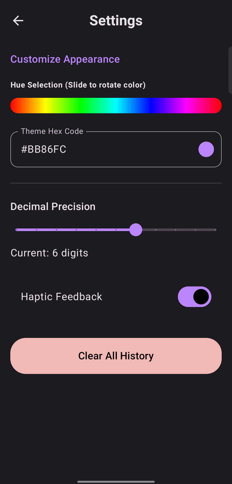
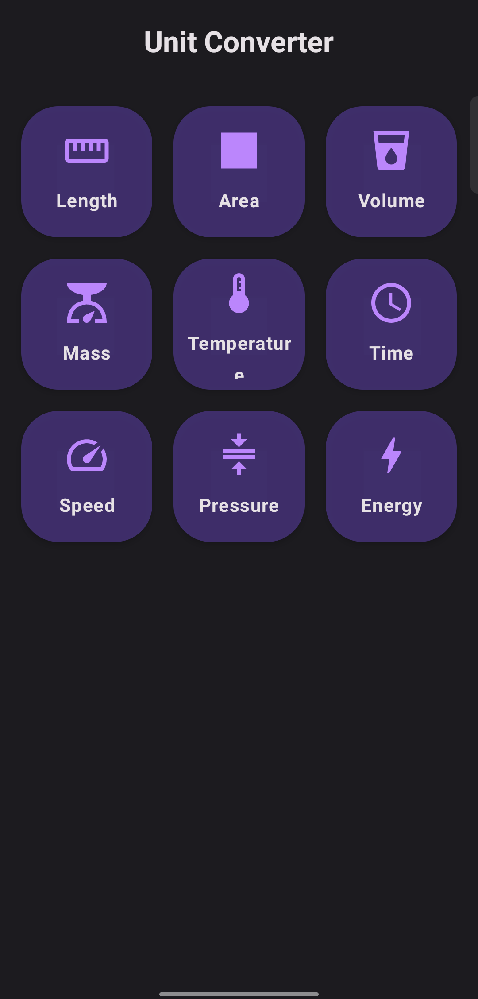

 Neo Calculator

  
  
  
  

Neo Calculator is more than just a calculator — it’s a complete offline utility toolkit built with a strong focus on privacy, performance, and modern design.

No internet. No ads. No tracking.
Just fast, reliable tools that work entirely on your device.

---

📱 App Gallery

  <table>
    <tr>
      <td></td>
      <td></td>
      <td></td>
      <td></td>
    </tr>
  </table>

---

✨ Features

🧮 Advanced Calculator

- High precision arithmetic engine
- Massive factorial support (up to 10,000!)
- Scientific notation & large number handling
- Smart history tracking

🛠️ Utility Tools

💰 Finance

- Discount & Tax Calculator
- Investment & SIP Calculator
- EMI Calculator
- Fuel Cost Calculator
- Unit Price Comparison

🌍 Converters

- Unit Converter (Length, Weight, Temp, Speed, Time, Data, etc.)
- Land Converter (Bigha, Acre, Sq.ft, Hectare)
- Currency Converter (offline with saved rates)

❤️ Personal Tools

- BMI Calculator
- Age Calculator
- GPA Calculator

---

🎨 Design

- Modern Glassmorphism UI
- Material Design 3
- Smooth animations & transitions
- Full Dark Mode support

---

🔒 Privacy First

- 100% Open Source (GPL-3.0)
- No Internet Permission
- No Ads
- No Data Collection
- Fully Offline

---

🛠️ Tech Stack

- Language: Kotlin
- UI: Jetpack Compose + Material 3
- Architecture: MVVM

---

📥 Installation

git clone https://github.com/Deepanjan008/Calculator.git
cd Calculator

Open in Android Studio, sync Gradle, and run on your device or emulator.

---

🤝 Contributing

Contributions are welcome!
Please open an issue first to discuss changes before submitting a PR.

---

📄 License

Licensed under the GPL-3.0 License

---

  <strong>Built with ❤️ for privacy-conscious users</strong>

